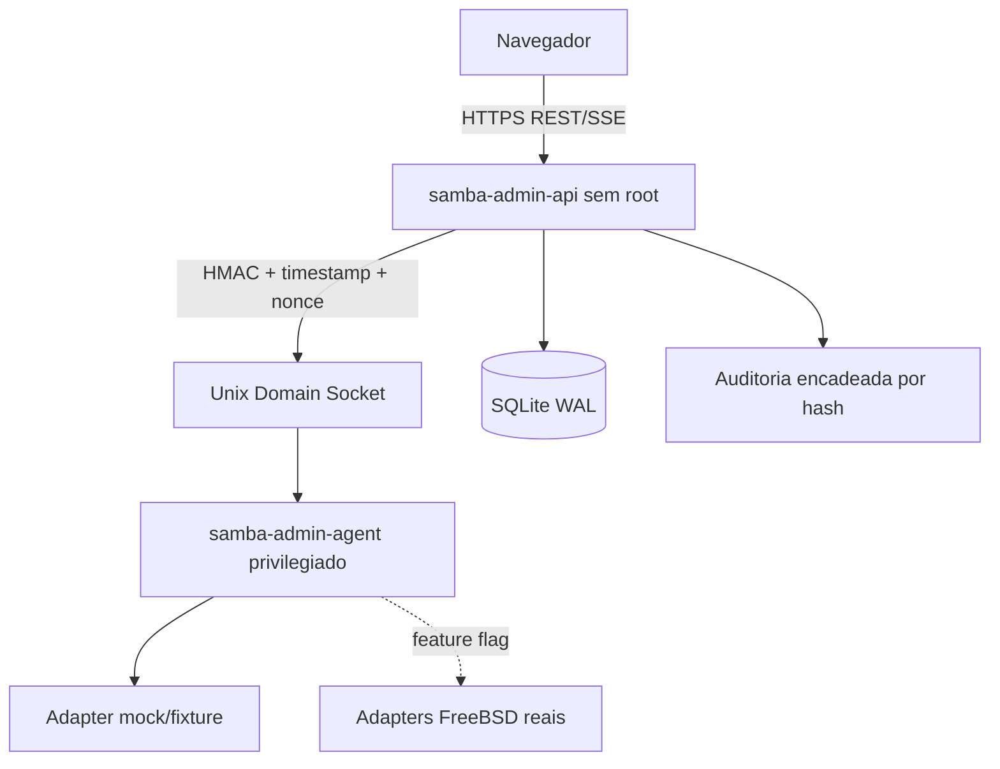
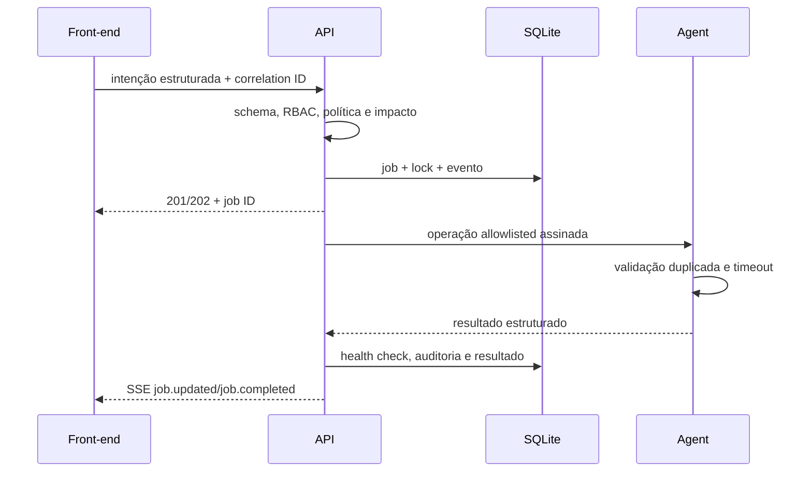

# Arquitetura

```mermaid
flowchart TD
  B[Navegador] -->|HTTPS REST/SSE| A[samba-admin-api sem root]
  A -->|HMAC + timestamp + nonce| U[Unix Domain Socket]
  U --> G[samba-admin-agent privilegiado]
  G --> M[Adapter mock/fixture]
  G -. feature flag .-> F[Adapters FreeBSD reais]
  A --> S[(SQLite WAL)]
  A --> E[Auditoria encadeada por hash]
```

## Sequência de alteração

```mermaid
sequenceDiagram
  participant UI as Front-end
  participant API as API
  participant DB as SQLite
  participant Agent as Agent
  UI->>API: intenção estruturada + correlation ID
  API->>API: schema, RBAC, política e impacto
  API->>DB: job + lock + evento
  API-->>UI: 201/202 + job ID
  API->>Agent: operação allowlisted assinada
  Agent->>Agent: validação duplicada e timeout
  Agent-->>API: resultado estruturado
  API->>DB: health check, auditoria e resultado
  API-->>UI: SSE job.updated/job.completed
```
